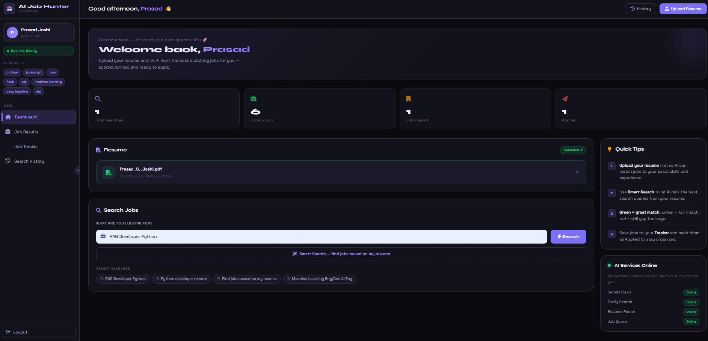
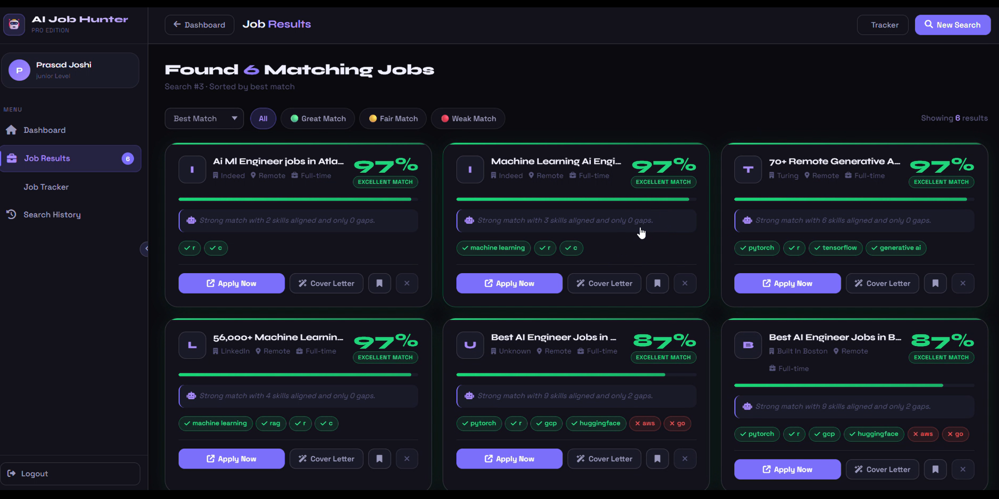
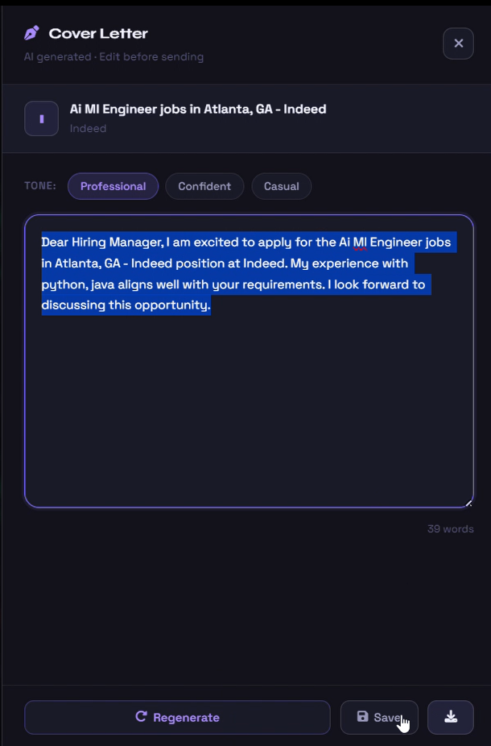
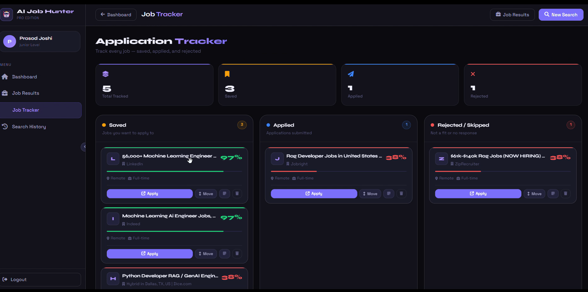

# 🤖 AI Job Hunter Pro

### Upload once. Apply smarter.

An autonomous AI agent that searches jobs, analyzes fit, scores opportunities, and generates personalized cover letters automatically.


---


# 📸 DEMO Images Preview

## 🔐 Dashboar page / Landing page


---

## 📊 Matching Job cards 


---


## 📝 Cover Letter Generator

---

## 🎯 Job tracker



---

# ✨ Features

- AI-powered job search
- Resume parsing & skill extraction
- Intelligent job scoring system
- Personalized AI cover letters
- Kanban job tracker
- Search history management
- Authentication system
- Smart filtering & sorting

---

# 🧠 How It Works

```text
Upload Resume
      ↓
AI extracts skills & experience
      ↓
Search jobs from internet
      ↓
Analyze job descriptions
      ↓
Score jobs based on profile match
      ↓
Generate personalized cover letters
      ↓
Track applications in Kanban board
```

---

# ⚡ Core Features

## 🔐 Authentication
- Register / Login
- Secure password hashing
- Protected routes

## 📄 Resume Intelligence
- Resume upload
- PDF parsing
- AI resume analysis
- Smart search suggestions

## 🌍 AI Job Search
- Real internet job search
- Job requirement extraction
- AI-based job scoring
- Filtering & sorting

## ✍️ Cover Letter Generator
- Personalized cover letters
- Multiple writing styles
- Editable inside UI

## 📌 Job Tracker
- Kanban board
- Saved / Applied / Rejected workflow
- Notes support

---

# 🛠️ Tech Stack

## Backend
- Flask
- SQLAlchemy
- SQLite
- pdfplumber
- SpaCy

## AI Layer
- Gemini 2.0 Flash
- LangChain
- Tavily API

## Frontend
- HTML
- CSS
- JavaScript

---

# 📂 Project Structure

```text
AI-JOB-HUNTER/
│
├── backend/
├── frontend/
├── uploads/
├── .env
├── .gitignore
├── requirements.txt
└── README.md
```

---

# 🔑 Environment Variables

Create a `.env` file:

```env
GEMINI_API_KEY=your_key
TAVILY_API_KEY=your_key
FLASK_SECRET_KEY=your_secret
```

---

# 🚀 Setup & Installation

## 1️⃣ Clone Repository

```bash
git clone https://github.com/Prasad-j1/jobhunt-agent.git
cd jobhunt-agent
```

## 2️⃣ Create Virtual Environment

### Windows

```bash
python -m venv venv
venv\Scripts\activate
```

### Mac/Linux

```bash
source venv/bin/activate
```

---

## 3️⃣ Install Dependencies

```bash
pip install -r requirements.txt
python -m spacy download en_core_web_md
```

---

## 4️⃣ Run Application

```bash
python -m backend.app
```

---

## 5️⃣ Open Browser

```text
http://localhost:5000
```

---

# 🔮 Future Improvements

- Telegram integration
- Email notifications
- Multi-agent workflow
- Cloud deployment
- Resume improvement suggestions
- LinkedIn automation

---

# 👨‍💻 Author

Prasad S. Joshi

GitHub:
https://github.com/Prasad-j1

---
